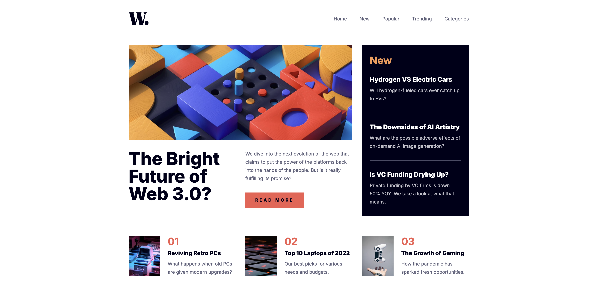

# News Homepage

## Table of contents

- [Overview](#overview)
  - [Screenshot](#screenshot)
  - [Links](#links)
- [My process](#my-process)
  - [Built with](#built-with)
- [Author](#author)

## Overview

### Screenshot

### Links

- Solution URL: [Solution URL](https://github.com/kisu-seo/news_homepage)
- Live Site URL: [Live URL](https://kisu-seo.github.io/news_homepage/)

## My process

### Built with

- **Semantic HTML5 Markup** - `<main>`, `<header>`, `<section>`, `<article>`, `<aside>` for proper document structure
- **Vanilla CSS** - Pure CSS without preprocessors or frameworks for maximum control
- **CSS Custom Properties (Variables)** - Centralized design tokens in `:root` for colors, spacing, typography
- **BEM Methodology** - Block Element Modifier naming convention (`.header__nav-link`, `.news__item--last`)
- **CSS Grid Layout** - 3-column desktop layout for hero, news, and featured sections
- **Flexbox Layout** - Responsive navigation, content alignment, and featured articles layout
- **rem Units** - Accessibility-first sizing (px → rem conversion except 1px borders)
- **Mobile-First Responsive** - Breakpoint-based design: Mobile → Tablet (768px) → Desktop (1024px)
- **Vanilla JavaScript (ES6+)** - IIFE pattern, no frameworks, pure DOM manipulation
- **JSDoc Documentation** - Comprehensive function documentation with `@param`, `@returns`, `@description`
- **Mobile Menu Toggle** - Hamburger menu with overlay, ESC key support, and auto-close on resize
- **Accessibility (a11y)** - ARIA attributes (`aria-expanded`, `aria-controls`, `aria-label`, `aria-hidden`)
- **Scope Isolation** - IIFE pattern to prevent global namespace pollution
- **Constants-Based** - String literals extracted as constants (`SELECTORS`, `CLASS_NAMES`, `KEYBOARD_KEYS`)
- **Smooth Transitions** - Hover effects on links and buttons with color transitions
- **Google Fonts** - Inter font family (Regular 400, Bold 700, Extra Bold 800) for typography
- **Responsive Images** - `<picture>` element for mobile/desktop image switching

## Author

- Website - [Kisu Seo](https://github.com/kisu-seo)
- Frontend Mentor - [@kisu-seo](https://www.frontendmentor.io/profile/kisu-seo)
